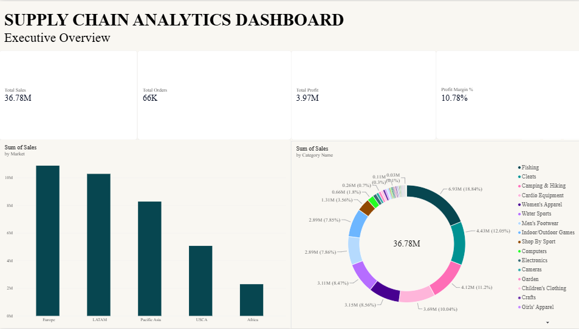
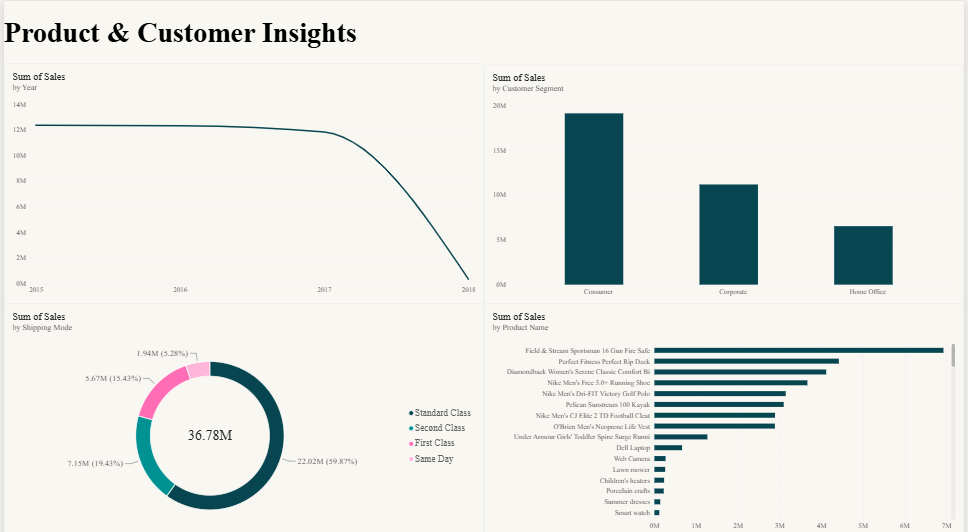

# Supply Chain Analytics Dashboard

## Overview
This project is an interactive Power BI dashboard built using a Supply Chain dataset. The dashboard provides insights into sales performance, profit, customer segments, shipping methods, markets, and product categories to support business decision-making.
The project demonstrates data cleaning using Power Query, DAX calculations, and interactive dashboard design.

---

##  Tools & Technologies

- Microsoft Power BI
- Power Query
- DAX (Data Analysis Expressions)

---

## 📈 Dashboard Features

### 📄 Page 1 – Executive Overview
- Total Sales KPI
- Total Profit KPI
- Total Orders KPI
- Profit Margin KPI
- Sales by Market
- Sales by Category

### 📄 Page 2 – Product & Customer Analysis
- Sales Trend
- Sales by Customer Segment
- Sales by Shipping Mode
- Top Products by Sales

---

## DAX Measures Used

- Total Sales
- Total Profit
- Total Orders
- Profit Margin %
- Average Order Value
- Europe Sales
- Pacific Asia Sales
- Europe Fishing Sales
- Business Performance

---

##  Dashboard Preview

### Executive Overview

### Product & Customer Analysis

---

##  Key Business Insights

- Compared sales performance across different markets.
- Identified top-performing product categories.
- Analyzed customer segments based on sales.
- Evaluated shipping mode distribution.
- Monitored overall business performance using KPI cards.

---

## Skills Demonstrated

- Data Cleaning
- Data Transformation
- Data Modeling
- DAX Calculations
- KPI Development
- Dashboard Design
- Business Intelligence
- Data Visualization

---

##  Repository Contents

- Supply-Chain-Analytics-Dashboard.pbix
- page1.png
- page2.png
- README.md

---

##  Author

**Darshita Yadav**
GitHub: https://github.com/darshita-yadav
---

 If you found this project interesting, feel free to explore the dashboard and provide feedback.
